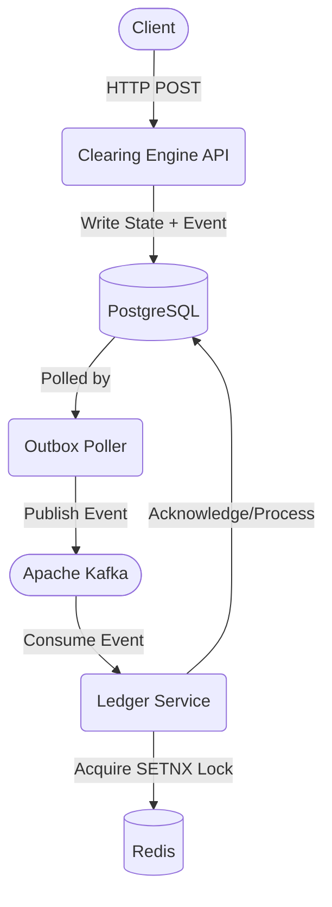

# Aegis Distributed Reconciliation & Clearing Engine

[]()
[]()
[]()
[]()

## Executive Summary
The Aegis Distributed Reconciliation & Clearing Engine is a financial backend system engineered to demonstrate enterprise-grade distributed systems patterns. It focuses on absolute data consistency, high availability, and strict idempotency across distributed components. The repository is structured as a Gradle multi-module monorepo containing two isolated bounded contexts: a synchronous HTTP REST API (`clearing-engine`) and an asynchronous event processor (`ledger-service`).

## System Architecture

The architecture implements an event-driven, eventually consistent model designed to avoid the distributed transaction (Two-Phase Commit) anti-pattern. 



### Flow Definition
1. **Ingestion:** The `clearing-engine` receives a request and validates the payload.
2. **Persistence:** The domain state and a corresponding event are persisted to a PostgreSQL database within a single ACID transaction (Transactional Outbox).
3. **Dispatch:** A dedicated scheduling thread continuously polls the outbox table and publishes events to Apache Kafka.
4. **Consumption:** The `ledger-service` consumes events from Kafka.
5. **Idempotency:** Before processing, the consumer attempts to acquire an atomic lock in Redis to prevent double-crediting.

## Key Architectural Decisions (ADRs)

### 1. Project Loom for I/O Concurrency
The API layer utilizes Java Virtual Threads (`SimpleAsyncTaskScheduler`) to handle high concurrency without exhausting OS-level thread pools during blocking I/O operations (database queries, network transmission). A `ContextPropagatingTaskDecorator` is explicitly implemented to guarantee that the Mapped Diagnostic Context (MDC) remains attached to the virtual thread, preventing the loss of Zipkin trace identifiers during context switches.

### 2. Transactional Outbox for Dual-Write Avoidance
Writing to a relational database and publishing to a message broker synchronously introduces a dual-write vulnerability, where the broker write could fail after the database commit. This system circumvents the issue by writing to an ACID-compliant Outbox table. A strict, timeout-bound (`.get(5, SECONDS)`) polling scheduler acts as the publisher, guaranteeing at-least-once delivery to Kafka.

### 3. Distributed Idempotency via Redis
Because the outbox pattern ensures at-least-once delivery, the consumer is exposed to duplicate messages (arising from network partitions or Kafka offset replay). The `ledger-service` enforces idempotency by executing an atomic `SETNX` operation in Redis, keyed by a composite business transaction identifier. The lock includes a 24-hour Time-To-Live (TTL). Failure to acquire the lock dictates that the message is a duplicate, resulting in an immediate safe acknowledgment without side effects.

### 4. Deterministic Rate Limiting
To prevent resource exhaustion under extreme load, the API enforces rate limiting via Resilience4j. Instead of relying on Spring Boot 4 auto-configuration—which abstracts away critical proxy behavior and load-shedding mechanisms—the rate limiters are explicitly wired using AspectJ proxies. This guarantees predictable interceptor chain execution at the application boundary.

### 5. API Contracts and Observability
All HTTP error responses strictly conform to the RFC 7807 Problem Details specification, establishing a predictable, machine-readable contract for clients. System observability is achieved via Micrometer Brave and Zipkin. Traces are injected at the HTTP ingress point, propagated through the database thread pools, and carried as Kafka headers to provide full end-to-end distributed tracing.

## System Failure Anticipation and Mitigation

Distributed systems must account for partial failure states. The following outlines the system's behavior under degraded conditions.

| Failure Mode | System Behavior | Mitigation Strategy |
|--------------|-----------------|---------------------|
| **Kafka Broker Unavailable** | Outbox poller encounters connection timeouts. | Poller suppresses exceptions, retries on the next tick. The Outbox table acts as a persistent buffer. No data is lost. |
| **Redis Node Failure** | Consumer fails to acquire/check idempotency lock. | Consumer halts processing and negative-acknowledges (NACK) the Kafka message. Offsets are not advanced, forcing a retry when Redis recovers. |
| **Database Pool Exhaustion** | API requests block waiting for connections. | Virtual threads suspend cheaply. Resilience4j Rate Limiter triggers load shedding, returning HTTP 429 to clients before memory is exhausted. |

## Local Development & Setup

### Prerequisites
- Java 27 SDK
- Docker & Docker Compose
- Gradle 8.x

### Infrastructure Provisioning
The application depends on containerized infrastructure. Initialize PostgreSQL, Kafka (KRaft), Redis, and Zipkin:

```bash
docker-compose up -d
```

### Application Execution
Start the monorepo bounded contexts via the Gradle wrapper:

```bash
./gradlew bootRun
```

## Testing Methodology

The testing strategy mandates absolute fidelity to the production environment. In-memory databases (e.g., H2) are explicitly prohibited due to behavioral drift.

All integration tests are orchestrated via **Testcontainers**, provisioning ephemeral Docker containers for PostgreSQL, Kafka, and Redis during the test lifecycle. The API layer is tested using the native Spring `RestClient`, ensuring accurate serialization, HTTP protocol adherence, and error deserialization validation.
